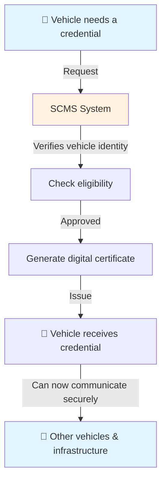
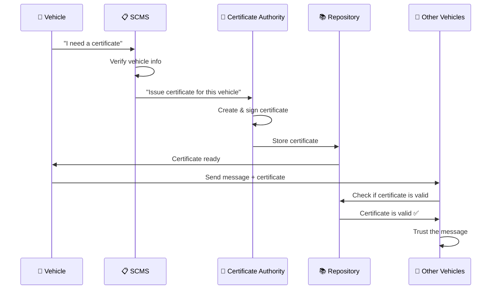
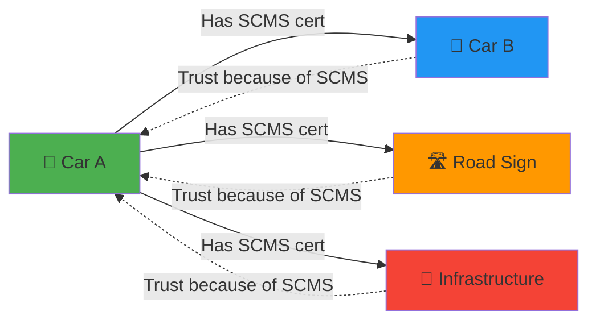
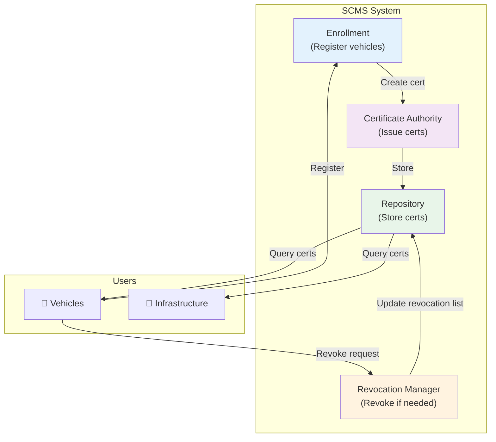
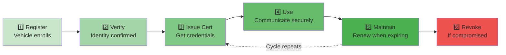
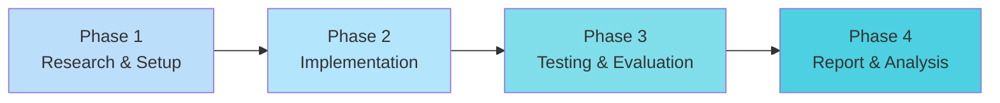

# SCMS: Secure Credential Management System

## What is SCMS?

**SCMS** (Secure Credential Management System) is software that manages and distributes digital credentials securely. Think of it like a "digital ID manager" that keeps track of who is authorized to do what in a system.

It's commonly used in **vehicular communication systems** (like cars talking to each other and infrastructure), but the concept applies to any system needing secure credential management.

---

## The Problem SCMS Solves

### Without SCMS:
```
Car A wants to send a message to Car B

But how does Car B know:
❌ Is Car A really who they claim to be?
❌ Can we trust this message?
❌ Is Car A authorized to send this type of message?
```

### With SCMS:
```
Car A has a digital certificate (credential) from SCMS
        ↓
SCMS verified and issued this certificate
        ↓
Car B trusts SCMS, so it trusts Car A
        ↓
Communication is secure and verified ✅
```

---

## How SCMS Works (Simple Overview)



---

## Key Components of SCMS

### 1. **Enrollment Server**
- Registers new vehicles
- Verifies they are legitimate
- Like a DMV for digital credentials

### 2. **Certificate Authority (CA)**
- Issues digital certificates
- Signs credentials to prove they're authentic
- Like a notary public

### 3. **Credential Repository**
- Stores all issued certificates
- Allows vehicles to look up credentials
- Like a public phone directory

### 4. **Revocation System**
- Can cancel credentials if something is wrong
- Like canceling an ID card
- Vehicles check this to ensure credentials haven't been revoked

### 5. **Certificate Manager**
- Tracks certificate lifecycle
- When they expire, renew them
- Like passport renewal

---

## SCMS Data Flow



---

## Real-World Example: C-V2X (Connected Vehicles)

**C-V2X** = Cellular Vehicle-to-Everything communication



**Why SCMS matters for C-V2X:**
- Cars need to communicate instantly (safety-critical)
- Can't afford to verify every single message manually
- SCMS pre-verifies everything so cars can trust instantly

---

## SCMS Architecture Overview



---

## Why Use SCMS? Key Benefits

| Benefit | Explanation |
|---------|-------------|
| **Trust** | Vehicles can instantly verify each other without manual checks |
| **Security** | Uses cryptography to prevent forged messages |
| **Scalability** | Can handle millions of vehicles efficiently |
| **Revocation** | Can instantly invalidate compromised credentials |
| **Privacy** | Can issue anonymous credentials (vehicles don't reveal identity) |

---

## SCMS Lifecycle for a Vehicle



---

## SCMS vs Manual Verification

### ❌ Without SCMS (Manual):
```
Each vehicle needs to verify every other vehicle
= 1000 vehicles × 999 verifications = 999,000 checks
= VERY SLOW ⏱️
```

### ✅ With SCMS (Pre-verified):
```
Vehicles trust SCMS once
= SCMS does the verification work centrally
= Instant trust ⚡
```

---

## Common Use Cases

1. **C-V2X**: Vehicles communicating safely on roads
2. **IoT Networks**: Devices authenticating each other
3. **Smart Cities**: Infrastructure (traffic lights, signals) communicating securely
4. **Medical Devices**: Healthcare systems verifying device credentials
5. **Industrial Systems**: Factory equipment authenticating with central systems

---

## Project Proposal: SCMS Performance Evaluation & Implementation

### What is Our Thesis?

> **"Secure Credential Management Systems can be effectively deployed on cloud platforms (AWS/Azure) to support large-scale C-V2X communications, with measurable performance characteristics suitable for real-time vehicular networks."**

### Problem Statement

Current automotive security relies heavily on centralized credential management. However:
- ❌ How well do SCMS implementations perform on cloud platforms?
- ❌ What are the latency/throughput trade-offs?
- ❌ Which cloud platform (AWS vs Azure) is better suited?
- ❌ Can SCMS scale to handle thousands of vehicles?

### What We're Proposing to Write/Develop


---

### Research Questions We're Answering

| Question | Why It Matters |
|----------|---------------|
| **How fast can SCMS verify credentials?** | Safety-critical systems need instant verification |
| **What's the scalability limit?** | Can it handle millions of vehicles? |
| **Which cloud platform performs better?** | Cost/performance optimization |
| **What are the failure modes?** | System reliability is critical |
| **How does latency change under load?** | Real-world performance prediction |
---

### How This Relates to Real-Time Operating Systems (RTOS)

| RTOS Concept | How SCMS Uses It |
|--------------|-----------------|
| **Real-Time Constraints** | Credential verification must be fast (deterministic latency) |
| **System Reliability** | Certificate revocation & failure recovery mechanisms |
| **Performance** | Throughput & latency critical for vehicular networks |
| **Scalability** | Managing thousands of concurrent credential requests |
| **Security** | PKI & cryptographic operations in time-critical systems |

---

### Project Timeline

| Phase | Key Deliverable |
|-------|-----------------|
| **Research & Setup** | Working SCMS deployment |
| **Implementation** | Test scripts & automation |
| **Testing & Evaluation** | Performance data collected |
| **Report & Presentation** | Final report + slides |
---
