# SCMS: Secure Credential Management System

## What is SCMS?

**SCMS** (Secure Credential Management System) is software that manages and distributes digital credentials securely. Think of it like a "digital ID manager" that keeps track of who is authorized to do what in a system.

It's commonly used in **vehicular communication systems** (like cars talking to each other and infrastructure), but the concept applies to any system needing secure credential management.

---

## The Problem SCMS Solves

### Without SCMS:
```
Car A wants to send a message to Car B

But how does Car B know:
❌ Is Car A really who they claim to be?
❌ Can we trust this message?
❌ Is Car A authorized to send this type of message?
```

### With SCMS:
```
Car A has a digital certificate (credential) from SCMS
        ↓
SCMS verified and issued this certificate
        ↓
Car B trusts SCMS, so it trusts Car A
        ↓
Communication is secure and verified ✅
```

---

## How SCMS Works (Simple Overview)

```mermaid
graph TD
    A["🚗 Vehicle needs a credential"] -->|Request| B["SCMS System"]
    B -->|Verifies vehicle identity| C["Check eligibility"]
    C -->|Approved| D["Generate digital certificate"]
    D -->|Issue| E["🚗 Vehicle receives credential"]
    E -->|Can now communicate securely| F["🚗 Other vehicles & infrastructure"]

    style A fill:#e1f5ff
    style B fill:#fff3e0
    style F fill:#e1f5ff
```



---

## Key Components of SCMS

### 1. **Enrollment Server**
- Registers new vehicles
- Verifies they are legitimate
- Like a DMV for digital credentials

### 2. **Certificate Authority (CA)**
- Issues digital certificates
- Signs credentials to prove they're authentic
- Like a notary public

### 3. **Credential Repository**
- Stores all issued certificates
- Allows vehicles to look up credentials
- Like a public phone directory

### 4. **Revocation System**
- Can cancel credentials if something is wrong
- Like canceling an ID card
- Vehicles check this to ensure credentials haven't been revoked

### 5. **Certificate Manager**
- Tracks certificate lifecycle
- When they expire, renew them
- Like passport renewal

---

## SCMS Data Flow

```mermaid
sequenceDiagram
    participant Vehicle as 🚗 Vehicle
    participant SCMS as 📋 SCMS
    participant CA as 🔐 Certificate Authority
    participant Repo as 📚 Repository
    participant Other as 🚗 Other Vehicles

    Vehicle->>SCMS: "I need a certificate"
    SCMS->>SCMS: Verify vehicle info
    SCMS->>CA: "Issue certificate for this vehicle"
    CA->>CA: Create & sign certificate
    CA->>Repo: Store certificate
    Repo->>Vehicle: Certificate ready

    Vehicle->>Other: Send message + certificate
    Other->>Repo: Check if certificate is valid
    Repo->>Other: Certificate is valid ✅
    Other->>Other: Trust the message
```



---

## Real-World Example: C-V2X (Connected Vehicles)

**C-V2X** = Cellular Vehicle-to-Everything communication

```mermaid
graph LR
    A["🚗 Car A"]
    B["🚗 Car B"]
    C["🛣️ Road Sign"]
    D["📡 Infrastructure"]

    A -->|"Has SCMS cert"| B
    A -->|"Has SCMS cert"| C
    A -->|"Has SCMS cert"| D

    B -.->|"Trust because of SCMS"| A
    C -.->|"Trust because of SCMS"| A
    D -.->|"Trust because of SCMS"| A

    style A fill:#4caf50
    style B fill:#2196f3
    style C fill:#ff9800
    style D fill:#f44336
```



**Why SCMS matters for C-V2X:**
- Cars need to communicate instantly (safety-critical)
- Can't afford to verify every single message manually
- SCMS pre-verifies everything so cars can trust instantly

---

## SCMS Architecture Overview

```mermaid
graph TB
    subgraph "SCMS System"
        A["Enrollment<br/>(Register vehicles)"]
        B["Certificate Authority<br/>(Issue certs)"]
        C["Repository<br/>(Store certs)"]
        D["Revocation Manager<br/>(Revoke if needed)"]
    end

    subgraph "Users"
        E["🚗 Vehicles"]
        F["📡 Infrastructure"]
    end

    E -->|Register| A
    A -->|Create cert| B
    B -->|Store| C
    C -->|Query certs| E
    C -->|Query certs| F
    E -->|Revoke request| D
    D -->|Update revocation list| C

    style A fill:#e3f2fd
    style B fill:#f3e5f5
    style C fill:#e8f5e9
    style D fill:#fff3e0
```



---

## Why Use SCMS? Key Benefits

| Benefit | Explanation |
|---------|-------------|
| **Trust** | Vehicles can instantly verify each other without manual checks |
| **Security** | Uses cryptography to prevent forged messages |
| **Scalability** | Can handle millions of vehicles efficiently |
| **Revocation** | Can instantly invalidate compromised credentials |
| **Privacy** | Can issue anonymous credentials (vehicles don't reveal identity) |

---

## SCMS Lifecycle for a Vehicle

```mermaid
graph LR
    A["1️⃣ Register<br/>Vehicle enrolls"] -->
    B["2️⃣ Verify<br/>Identity confirmed"] -->
    C["3️⃣ Issue Cert<br/>Get credentials"] -->
    D["4️⃣ Use<br/>Communicate securely"] -->
    E["5️⃣ Maintain<br/>Renew when expiring"] -->
    F["6️⃣ Revoke<br/>If compromised"]

    E -.->|"Cycle repeats"| C

    style A fill:#c8e6c9
    style B fill:#a5d6a7
    style C fill:#81c784
    style D fill:#66bb6a
    style E fill:#4caf50
    style F fill:#ef5350
```



---

## SCMS vs Manual Verification

### ❌ Without SCMS (Manual):
```
Each vehicle needs to verify every other vehicle
= 1000 vehicles × 999 verifications = 999,000 checks
= VERY SLOW ⏱️
```

### ✅ With SCMS (Pre-verified):
```
Vehicles trust SCMS once
= SCMS does the verification work centrally
= Instant trust ⚡
```

---

## Common Use Cases

1. **C-V2X**: Vehicles communicating safely on roads
2. **IoT Networks**: Devices authenticating each other
3. **Smart Cities**: Infrastructure (traffic lights, signals) communicating securely
4. **Medical Devices**: Healthcare systems verifying device credentials
5. **Industrial Systems**: Factory equipment authenticating with central systems


## References

- **SCMS Overview**: IEEE 1609.2 (Vehicle-to-Vehicle Communication)
- **C-V2X Standard**: 3GPP 5G V2X specification
- **PKI Basics**: Understanding Public Key Infrastructure (PKI)
- **Cryptography**: Digital signatures and certificates explained

---